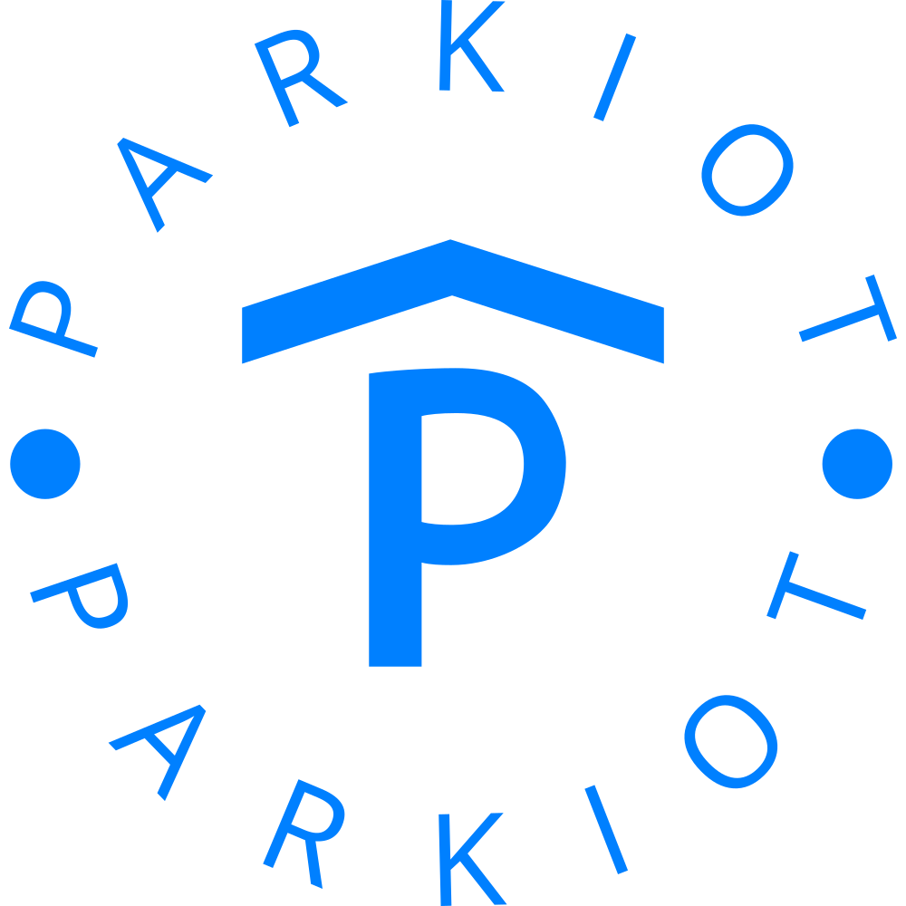

# SISTEMA IOT CON MACHINE LEARNING PARA EL CONTROL DE ESTACIONAMIENTO VEHICULAR EN EL COMERCIAL MIÑACA DEL CANTÓN SANTO DOMINGO

<!--  -->

    

Proyecto de Grado: un sistema IoT que utiliza Machine Learning para el control de estacionamiento vehicular en el Comercial Miñaca del Cantón Santo Domingo.

## Tecnologías Utilizadas

- **Django REST Framework**: Framework de desarrollo web para la creación de APIs RESTful con Django.
- **NodeJS with React**: Plataforma de ejecución de JavaScript para construir aplicaciones web escalables y el framework React para el desarrollo de interfaces de usuario.
- **MySQL 8**: Sistema de gestión de bases de datos relacional que utiliza SQL para consultas y transacciones.
- **Node-Red**: Herramienta de desarrollo visual para la creación de flujos de trabajo basados en Node.js.
- **MQTT**: Protocolo de mensajería ligero y eficiente para la comunicación entre dispositivos en una red.
- **ESP32 NodeMCU**: Placa de desarrollo para el microcontrolador ESP32, utilizado para la integración de dispositivos IoT.
- **WiFi 802.11n**: Estándar de red inalámbrica utilizado para la conectividad de los dispositivos IoT.
- **Servidor**: Equipo dedicado que actúa como punto central para coordinar la operación del sistema y gestionar la comunicación entre los diferentes componentes.
- **Librería _scikit-learn_ con Regresión Logística**: Biblioteca de Machine Learning para Python que incluye el algoritmo de Regresión Logística, utilizado para mejorar la precisión en la detección de vehículos.

## Funcionalidades Principales

El sistema ParkIoT se diseñó con las siguientes funcionalidades clave:

1. **Detección de Vehículos**: Utilizando tecnología IoT, el sistema puede identificar la presencia de vehículos en los estacionamientos.

2. **Machine Learning con _scikit-learn_**: Se utiliza la biblioteca _scikit-learn_ con el algoritmo de Regresión Logística para mejorar la precisión en la detección de vehículos.

3. **API RESTful con Django**: Se implementa una API RESTful utilizando Django REST Framework para la interacción entre el sistema y otras aplicaciones.

4. **Interfaz de Usuario con React**: La interfaz de usuario se construye con React para proporcionar una experiencia de usuario moderna e interactiva.

5. **Base de Datos MySQL 8**: Se utiliza MySQL como sistema de gestión de bases de datos para almacenar y recuperar información relacionada con los vehículos detectados.

6. **Integración de NodeRed y MQTT**: La integración de NodeRed y MQTT permite la comunicación eficiente entre los dispositivos IoT y el servidor central.

7. **Dispositivos ESP32 NodeMCU**: Los dispositivos ESP32 NodeMCU se utilizan para la detección local de vehículos, enviando datos al servidor a través de la red WiFi.

8. **Centralización con el Servidor**: El servidor actúa como un punto central que coordina la operación del sistema y gestiona la comunicación entre los diferentes componentes.

## Instalación

Para instalar y configurar el sistema ParkIoT en tu entorno de desarrollo, sigue estos pasos:

1. **Clona el Repositorio**: `git clone https://github.com/pcruz99/ParkIoT.git`

2. **Configuración del Entorno Django**: ...

3. **Instalación de Dependencias de React**: ...

4. **Configuración de la Base de Datos MariaDB**: ...

...

¡Con estos pasos, tendrás el sistema ParkIoT funcionando en tu entorno local!

## Contribuciones

¡Las contribuciones al proyecto son bienvenidas! Si deseas contribuir, sigue estos pasos:

1. Realiza un fork del repositorio.

2. Crea una nueva rama para tu contribución: `git checkout -b feature/nueva-funcionalidad`.

3. Realiza tus cambios y commitea: `git commit -m "Añade nueva funcionalidad"`.

4. Realiza un push a tu rama: `git push origin feature/nueva-funcionalidad`.

5. Abre un Pull Request en [https://github.com/pcruz99/ParkIoT](https://github.com/pcruz99/ParkIoT).

¡Gracias por contribuir al proyecto ParkIoT!
